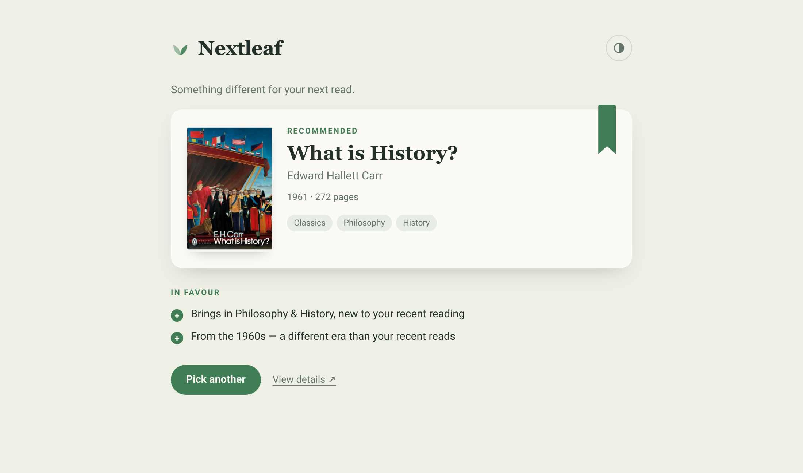
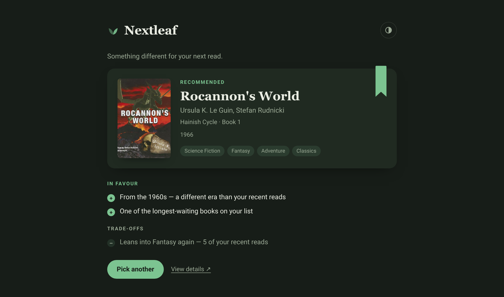

# NextLeaf

A small self-hosted service that picks your next read from your
[Hardcover](https://hardcover.app) *Want to Read* list and/or the unread
books in your [Grimmory](https://github.com/grimmory-tools/grimmory) library.
The twist is that it optimises for variety rather than similarity: it looks at
what you've read recently and weights the pick toward genres, authors and
formats you've been neglecting, so you don't end up reading the same kind of
book five times in a row. A series you're in the middle of still gets a fair
shot. Configured sources are merged, so one pick draws on all of them.


*A variety-weighted pick, and why it was chosen.*


*Dark mode, following the system theme. Any trade-offs of a pick are shown too.*

## Configuration

Everything is configured through environment variables. In development a local
`.env` file is loaded automatically.

| Variable            | Default      | Description                                     |
| ------------------- | ------------ | ----------------------------------------------- |
| `HARDCOVER_TOKEN`   | *(optional)* | Hardcover API token.                            |
| `GRIMMORY_URL`      | *(optional)* | Base URL of a Grimmory instance.                |
| `GRIMMORY_USERNAME` | *(optional)* | Grimmory account username.                      |
| `GRIMMORY_PASSWORD` | *(optional)* | Grimmory account password (local login).        |
| `ADDR`              | `:8080`      | Address the server listens on.                  |

At least one source is needed for recommendations; without any the app still
starts and the home page shows a setup hint instead. Grimmory needs all three
of its variables. Books you haven't touched in Grimmory count as unread, your
reading and read statuses feed the variety profile, and read status is
per-user — so use your own account. If you normally sign in through OIDC, set
a local password on that same account for NextLeaf to use (Grimmory has no
long-lived API keys; NextLeaf logs in and refreshes its session by itself).

## Deployment

Docker Compose is the recommended way to run it — the config lives in a file
you can keep in version control, and the container comes back up after a
reboot:

```yaml
services:
  nextleaf:
    image: ghcr.io/supergamer1337/nextleaf:latest
    restart: unless-stopped
    ports:
      - "8080:8080"
    environment:
      HARDCOVER_TOKEN: your-token
      # Or (also works alongside Hardcover):
      # GRIMMORY_URL: https://grimmory.example.com
      # GRIMMORY_USERNAME: your-user
      # GRIMMORY_PASSWORD: your-password
```

```sh
docker compose up -d
```

A plain `docker run` works just as well:

```sh
docker run -d --name nextleaf --restart unless-stopped \
  -p 8080:8080 -e HARDCOVER_TOKEN=your-token \
  ghcr.io/supergamer1337/nextleaf:latest
```

Either way the app is now at `http://localhost:8080`. There is no state to
persist, so no volumes are needed. `/healthcheck` returns 200 when the server
is up, which is handy for a reverse proxy or uptime monitor — but check it
from outside the container: the image is built `FROM scratch` (just the static
binary and CA certificates), so there is no shell or curl inside for a
Docker-level healthcheck to use.

## Development

Requires Go 1.26+. On Nix, `nix develop` gives you the toolchain.

```sh
echo 'HARDCOVER_TOKEN=your-token' > .env   # or export it
go run ./cmd/nextleaf                       # serves http://localhost:8080
```

Tests:

```sh
go test ./...
```

For now, NextLeaf uses no external dependencies.
