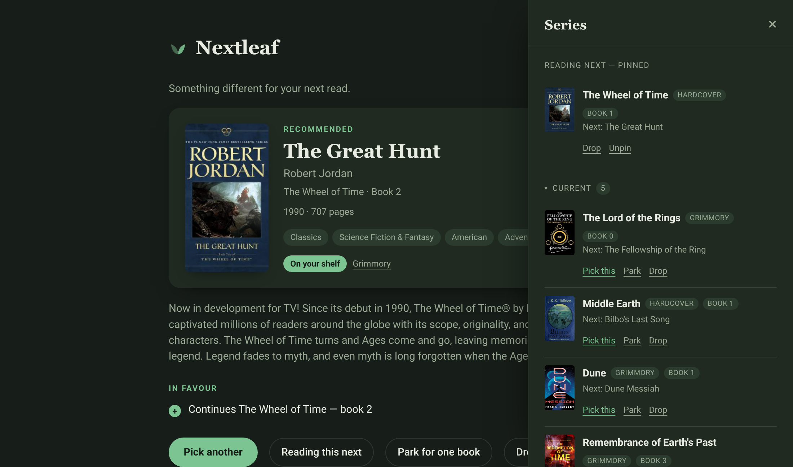

# NextLeaf

NextLeaf is a small self-hosted service that picks your next read. It draws on
your [Hardcover](https://hardcover.app) *Want to Read* list, the unread books
in your [Grimmory](https://github.com/grimmory-tools/grimmory) library, or
both.

It aims for variety, not similarity. It looks at what you've read recently and
weights the pick toward the genres, authors and formats you've been
neglecting, so you don't read the same kind of book five times in a row. With
both sources set up, one pick draws on both, and NextLeaf never recommends a
book you've read or are reading in either.

## Series

Finish a book in a series and NextLeaf offers the next one first, even if it
isn't on your reading list. The recommendation has two buttons for that.

- **Park for one book** skips the series once. It comes back as soon as you
  finish anything else.
- **Drop this series** ends the continuations and takes the series' books out
  of the pool. Add one of them back to your reading list to undo it.

The Series drawer lists every series you're in. Each row lets you pick the
series to read next, park it, drop it, or undo any of those. Series you've
caught up with sit under Finished and move back out when a new book appears.
If a series goes by several names, the ⇄ button picks which one the row
follows.

NextLeaf never recommends a book that isn't out yet. It offers novellas at
half positions, such as book 3.5, unless you turn that off.




## Configuration

NextLeaf reads its configuration from environment variables. In development it
also loads a local `.env` file.

| Variable            | Default      | Description                                     |
| ------------------- | ------------ | ----------------------------------------------- |
| `HARDCOVER_TOKEN`   | *(optional)* | Hardcover API token.                            |
| `GRIMMORY_URL`      | *(optional)* | Base URL of a Grimmory instance.                |
| `GRIMMORY_USERNAME` | *(optional)* | Grimmory account username.                      |
| `GRIMMORY_PASSWORD` | *(optional)* | Grimmory account password.                      |
| `ADDR`              | `:8080`      | Address the server listens on.                  |
| `DATA_DIR`          | `.`          | Directory holding the series database.          |
| `INCLUDE_NOVELLAS`  | `true`       | Offer novellas such as book 3.5.                |

You need at least one source. Without one the app still starts and shows a
setup hint. Grimmory needs all three of its variables. Use your own Grimmory
account, because Grimmory tracks read status per user. If you sign in through
OIDC, set a local password on that account for NextLeaf to use.

## Deployment

Docker Compose is the easiest way to run it. The config lives in a file you can
keep in version control, and the container comes back up after a reboot.

```yaml
services:
  nextleaf:
    image: ghcr.io/supergamer1337/nextleaf:latest
    restart: unless-stopped
    ports:
      - "8080:8080"
    volumes:
      - nextleaf-data:/data
    environment:
      HARDCOVER_TOKEN: your-token
      # Grimmory, instead of or alongside Hardcover:
      # GRIMMORY_URL: https://grimmory.example.com
      # GRIMMORY_USERNAME: your-user
      # GRIMMORY_PASSWORD: your-password

volumes:
  nextleaf-data:
```

```sh
docker compose up -d
```

A plain `docker run` works too.

```sh
docker run -d --name nextleaf --restart unless-stopped \
  -p 8080:8080 -e HARDCOVER_TOKEN=your-token \
  -v nextleaf-data:/data \
  ghcr.io/supergamer1337/nextleaf:latest
```

Either way the app is now at `http://localhost:8080`. Keep the volume. It holds
your series decisions, and without it you lose them every time you replace the
container. `/healthcheck` returns 200 when the server is up. Check it from
outside the container, because the image has no shell or curl inside.

## Development

You need Go 1.26 or newer. On Nix, `nix develop` gives you the toolchain.

```sh
echo 'HARDCOVER_TOKEN=your-token' > .env   # or export it
go run ./cmd/nextleaf                       # serves http://localhost:8080
```

Run the tests with:

```sh
go test ./...
```
