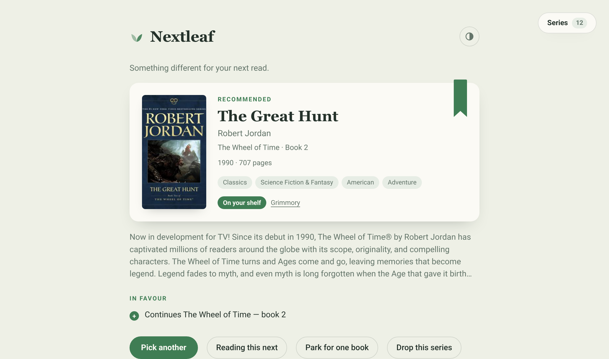
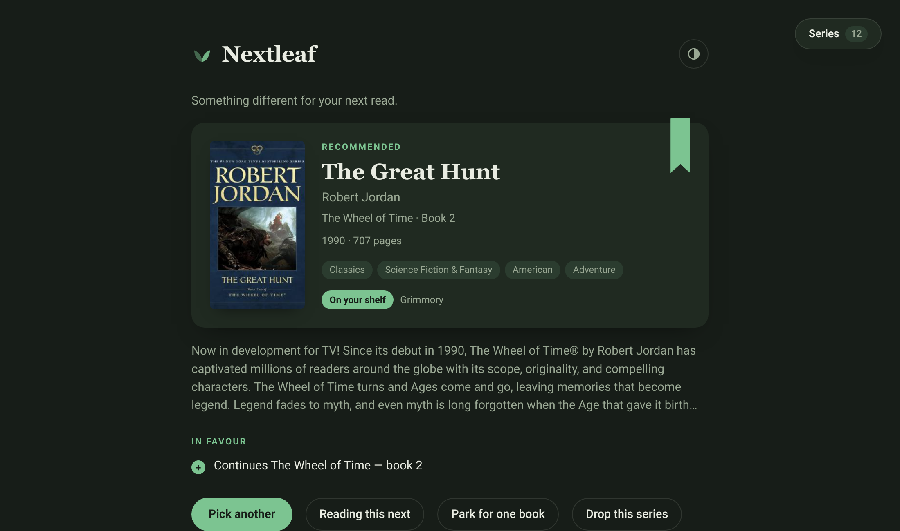

# NextLeaf

A small self-hosted service that picks your next read from your
[Hardcover](https://hardcover.app) *Want to Read* list and/or the unread
books in your [Grimmory](https://github.com/grimmory-tools/grimmory) library.
The twist is that it optimises for variety rather than similarity: it looks at
what you've read recently and weights the pick toward genres, authors and
formats you've been neglecting, so you don't end up reading the same kind of
book five times in a row. A series you're in the middle of still gets a fair
shot. Configured sources are merged, so one pick draws on all of them — and a
book you've read or are reading in any source is dropped from the pool, even
if another source still lists it as to-read.

## Series tracking

Every series you read into is remembered, along with how far you got. Finish a
book and the next one is what you're offered first, whether or not it's on your
reading list — including a volume published years after you finished the series,
which is the case a to-read list can't cover. Each recommendation carries three
decisions:

- **Reading this next** pins the series to the front of the queue until you
  start that book.
- **Park for one book** steps over the series once. It comes back as soon as
  you finish anything else, so a park costs exactly the one instance it says.
- **Drop this series** retires it: no more continuations, and its books leave
  the variety pool too. Adding one of its books back to your reading list undoes
  it.

A folding panel under the recommendation lists everything tracked and is where
you unpin, resume or undrop. Books that aren't out yet are never recommended,
and novellas at half-positions (book 3.5) are offered unless you turn them off.


*A variety-weighted pick, and why it was chosen.*


*Dark mode, following the system theme. Any trade-offs of a pick are shown too.*

## Configuration

Everything is configured through environment variables. In development a local
`.env` file is loaded automatically.

| Variable            | Default      | Description                                     |
| ------------------- | ------------ | ----------------------------------------------- |
| `HARDCOVER_TOKEN`   | *(optional)* | Hardcover API token.                            |
| `GRIMMORY_URL`      | *(optional)* | Base URL of a Grimmory instance.                |
| `GRIMMORY_USERNAME` | *(optional)* | Grimmory account username.                      |
| `GRIMMORY_PASSWORD` | *(optional)* | Grimmory account password (local login).        |
| `ADDR`              | `:8080`      | Address the server listens on.                  |
| `DATA_DIR`          | `.`          | Directory holding the series database.          |
| `INCLUDE_NOVELLAS`  | `true`       | Offer novellas at half-positions (book 3.5).    |

At least one source is needed for recommendations; without any the app still
starts and the home page shows a setup hint instead. Grimmory needs all three
of its variables. Books you haven't touched in Grimmory count as unread, your
reading and read statuses feed the variety profile, and read status is
per-user — so use your own account. If you normally sign in through OIDC, set
a local password on that same account for NextLeaf to use (Grimmory has no
long-lived API keys; NextLeaf logs in and refreshes its session by itself).
Grimmory covers sit behind its login, so NextLeaf relays them at
`/cover/grimmory/{id}` — credentials stay server-side and browsers cache the
images for a day.

Series tracking keeps a small SQLite database in `DATA_DIR`. On first start
NextLeaf imports your whole reading history in the background; until that
finishes you get variety picks and a note saying so. Set `INCLUDE_NOVELLAS=false`
if you'd rather be pointed at book 4 than book 3.5.

## Deployment

Docker Compose is the recommended way to run it — the config lives in a file
you can keep in version control, and the container comes back up after a
reboot:

```yaml
services:
  nextleaf:
    image: ghcr.io/supergamer1337/nextleaf:latest
    restart: unless-stopped
    ports:
      - "8080:8080"
    volumes:
      - nextleaf-data:/data
    environment:
      HARDCOVER_TOKEN: your-token
      # Or (also works alongside Hardcover):
      # GRIMMORY_URL: https://grimmory.example.com
      # GRIMMORY_USERNAME: your-user
      # GRIMMORY_PASSWORD: your-password

volumes:
  nextleaf-data:
```

```sh
docker compose up -d
```

A plain `docker run` works just as well:

```sh
docker run -d --name nextleaf --restart unless-stopped \
  -p 8080:8080 -e HARDCOVER_TOKEN=your-token \
  -v nextleaf-data:/data \
  ghcr.io/supergamer1337/nextleaf:latest
```

Either way the app is now at `http://localhost:8080`. The volume holds your
series decisions and reading positions; without it they are lost every time the
container is replaced. `/healthcheck` returns 200 when the server
is up, which is handy for a reverse proxy or uptime monitor — but check it
from outside the container: the image is built `FROM scratch` (just the static
binary and CA certificates), so there is no shell or curl inside for a
Docker-level healthcheck to use.

## Development

Requires Go 1.26+. On Nix, `nix develop` gives you the toolchain.

```sh
echo 'HARDCOVER_TOKEN=your-token' > .env   # or export it
go run ./cmd/nextleaf                       # serves http://localhost:8080
```

Tests:

```sh
go test ./...
```

NextLeaf's only dependency is `modernc.org/sqlite`, a pure-Go SQLite driver, so
the build stays CGO-free. Everything else is the standard library. See
[docs/adr/0001-sqlite-for-series-state.md](docs/adr/0001-sqlite-for-series-state.md)
for why that dependency was taken.
